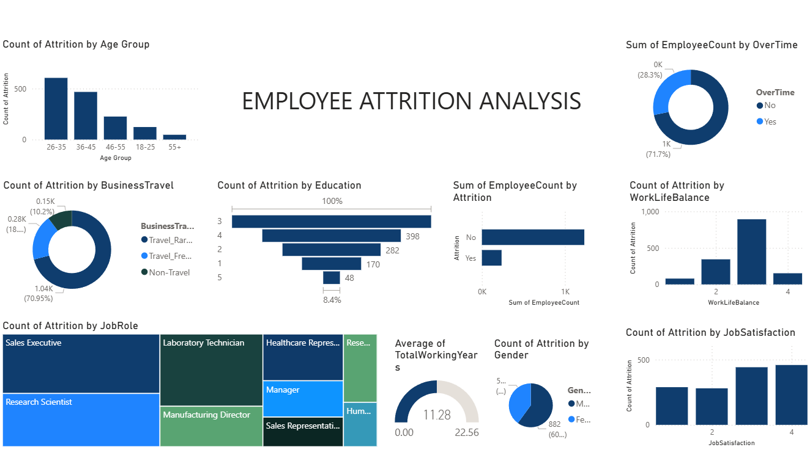

# HR Employee Attrition Analysis Dashboard

## Overview

This project analyzes employee attrition patterns using the IBM HR Analytics dataset in Power BI. The dashboard identifies key demographic, behavioral, and job-related factors contributing to workforce turnover and provides actionable insights to support employee retention strategies.

---

## Tools & Technologies

- Power BI
- DAX
- Data Modeling
- Data Visualization
- HR Analytics

---

## Business Problem

Employee attrition creates significant costs related to recruitment, onboarding, productivity loss, and knowledge transfer. This dashboard helps organizations understand the factors driving employee turnover and identify areas requiring retention-focused interventions.

---

## Dashboard Highlights

- Overall Employee Attrition & Retention Analysis
- Age Group Attrition Analysis
- Business Travel Impact on Attrition
- Education Level Attrition Distribution
- Overtime vs Attrition Analysis
- Work-Life Balance Impact on Employee Turnover
- Job Satisfaction & Attrition Analysis
- Attrition by Job Role
- Employee Tenure & Retention Analysis
- Interactive HR KPI Monitoring

---

## Dashboard Preview

### Attrition Analysis

## Key Findings

### Age-Based Attrition
Employees aged **26–35** experience the highest attrition levels, indicating increased mobility among early-career professionals.

### Business Travel Impact
Employees who travel frequently for business demonstrate significantly higher attrition rates compared to non-traveling employees.

### Education Analysis
Employees holding a **Bachelor's Degree** account for the largest proportion of attrition cases.

### Overtime Effect
Employees working overtime exhibit substantially higher turnover, suggesting workload pressure and burnout as major contributors to attrition.

### Work-Life Balance
Work-life balance perceptions have a strong influence on employee retention, with lower ratings associated with increased attrition risk.

### Job Role Analysis
**Sales Executives** and **Research Scientists** contribute the highest attrition volumes, highlighting the need for role-specific retention strategies.

### Overall Workforce Retention
The organization maintains an overall retention rate of approximately **84%**, while experiencing an attrition rate of nearly **16%**.

---

## Recommendations

### 1. Early-Career Development Programs
Implement structured career development pathways, mentorship programs, and promotion frameworks for employees aged 26–35.

### 2. Overtime Monitoring
Monitor workload distribution and reduce excessive overtime through resource planning and flexible work arrangements.

### 3. Role-Specific Retention Strategies
Design tailored retention initiatives for Sales Executives and Research Scientists, including career growth opportunities and performance-based incentives.

### 4. Business Travel Optimization
Review travel requirements and introduce flexible work policies to improve employee well-being and long-term retention.

---

## Business Impact

This project demonstrates how HR analytics can be leveraged to:

- Identify key drivers of employee turnover
- Improve workforce planning
- Support data-driven HR decision-making
- Enhance employee retention strategies
- Reduce attrition-related organizational costs

---

## Dataset

IBM HR Analytics Employee Attrition & Performance Dataset

Source: Kaggle

---

## Author

Steffi Angel

Power BI | Data Analytics | Business Intelligence
